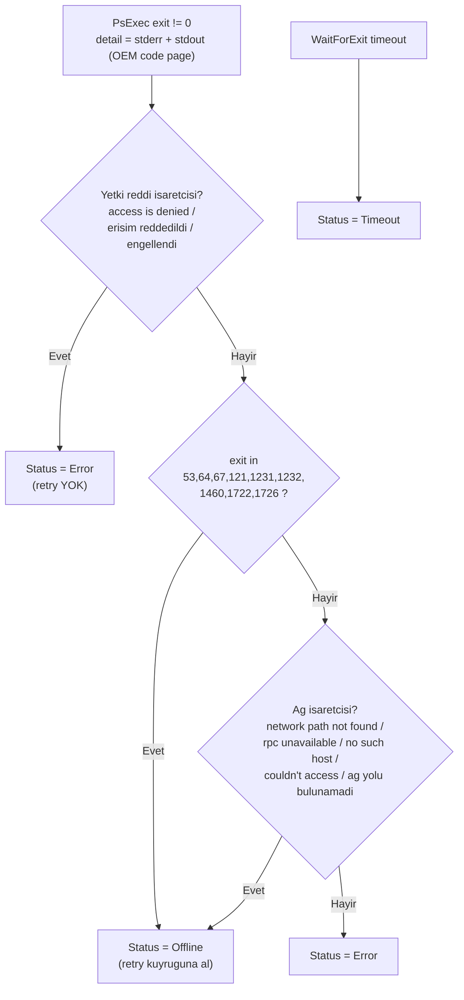
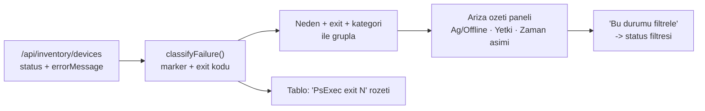

# Collector Runtime ve Offline Teshis Mimarisi

Bu dokuman PsExec collector'inin uctan uca calisma akisini, servis kimliginin
ag uzerindeki davranisini ve bir cihazin neden `Offline` / `Error` /
`Timeout` olarak siniflandirildigini gosterir. Amaci "tum cihazlar offline"
gibi olaylarda kok nedeni hizli ve kanitli sekilde bulmaktir.

Ilgili dosyalar:

- Kod: [`PsExecCollectorRunner.cs`](../src/O365AuditTool/Services/PsExecCollectorRunner.cs),
  [`ScanOrchestratorService.cs`](../src/O365AuditTool/Services/ScanOrchestratorService.cs)
- Alan teshisi: [`Invoke-CollectorAccessDiagnostic.ps1`](../scripts/Invoke-CollectorAccessDiagnostic.ps1)
- Analiz: [`CLAUDE-FINDINGS-PSEXEC-OFFLINE.md`](CLAUDE-FINDINGS-PSEXEC-OFFLINE.md)
- Yetkiler: [`DEPLOYMENT-DC.md`](DEPLOYMENT-DC.md)

## 1. Collector calisma akisi (servis kimligi vurgulu)

Yonetim servisi `LocalSystem` ise uzak erisim yonetim sunucusunun **bilgisayar
hesabi** (`DOMAIN\SERVERNAME$`) ile yapilir; gMSA ise gMSA kimligi kullanilir.
Dashboard kullanicisinin kimligi endpoint'e **tasinmaz** (delegation yok).

```mermaid
sequenceDiagram
    autonumber
    participant O as Scan orchestrator
    participant R as PsExecCollectorRunner
    participant P as PsExec (\\TARGET)
    participant E as Endpoint SYSTEM
    participant S as Collector share (\\NBRADC\o365audit)
    participant D as SQLite

    O->>R: RunAsync(deviceName)
    R->>R: PsExec + collector SHA-256 dogrula
    R->>P: psexec \\TARGET -h -s powershell -EncodedCommand ...
    Note over P,E: Kimlik = servis kimligi (makine hesabi / gMSA), -u/-p YOK
    P->>E: ADMIN$ + SCM ile gecici PSEXESVC olustur
    E->>S: collector.ps1 oku + pinned SHA-256 dogrula
    E->>E: Tum yerel profillerde envanter topla
    E-->>P: JSON (stdout)
    P-->>R: stdout + stderr + exit code
    R->>R: exit 0 -> payload; exit != 0 -> siniflandir
    R-->>O: CollectResult(Success | Offline | Error | Timeout, ExitCode)
    O->>D: payload veya hata kaydi (errorMessage = "PsExec exit N: ...")
```

Kritik nokta: ADMIN$/SCM erisimi bu akista **servis kimligiyle** denenir.
Interaktif yoneticiyle yapilan `Test-Path \\TARGET\ADMIN$` bunu kanitlamaz;
`Invoke-CollectorAccessDiagnostic.ps1` testleri bu yuzden `psexec -s` ile kosar.

## 2. Offline / Error / Timeout siniflandirmasi

`IsOfflineFailure` yetki-reddi isaretcilerine ag isaretcilerinden **oncelik**
verir. Onemli sonuc: **erisim reddi `Error`'dur, `Offline` degildir.**



### "Tum cihazlar Offline" ne anlama gelir

Her cihaz `Offline` ise, her biri **ag/RPC sinifi** bir hata uretmistir
(yetki reddi olsaydi `Error` gorurduk). Bu, yonetim sunucusundan endpointlere
**ortam genelinde SMB/erisim blokaji** isaretidir:

| Belirti | Muhtemel kok neden |
|---|---|
| exit 53 / "network path not found" | TCP 445 kapali (firewall/GPO), ADMIN$ devre disi, cihaz kapali |
| exit 1722 / "rpc server unavailable" | Uzak SCM/RPC erisilemiyor |
| "no such host is known" | DNS bayat/yanlis |
| exit 5 / "access is denied" (=> **Error**) | Servis kimligi endpoint admin degil (ama bu Offline degil) |

Yani uniform all-offline, "makine hesabi endpoint admin degil" (hipotez #1)
yerine **TCP 445 / ADMIN$ / firewall** (hipotez #2) veya DNS'i isaret eder.

## 3. Yerellestirilmis metin (OEM code page)

Turkce endpointlerde PsExec/Windows hata metni OEM konsol code page'i
(CP857/CP1254) ile yazilir. Collector, redirected stream encoding'ini host'un
OEM code page'ine sabitler; aksi halde "Erisim reddedildi" gibi metinler
bozulur ve isaretciler eslesmez. `IsOfflineFailure`'a beslenen `detail` metni
stderr + stdout birlesimidir ve exit kodu kalici mesaja `PsExec exit N: ...`
onekiyle yazilir.

## 4. Dashboard: Ariza ozeti UX

Envanter yuklendiginde basarisiz cihazlar tam nedene ve PsExec exit koduna
gore gruplanir; operator yuzlerce satiri taramadan kok nedeni gorur.



## 5. Alan teshisini calistirma

Yonetim sunucusunda (NBRADC), yukseltilmis PowerShell:

```powershell
.\scripts\Invoke-CollectorAccessDiagnostic.ps1 -Target PC-TEST-01
```

Cikti; servis kimligini, DNS/445 (interaktif), ADMIN$/SCM (servis kimligiyle)
sonuclarini, collector share hash kontrolunu ve gercek collector cagrisinin
**tam exit kodu + hata metnini** verir; sonunda karar agacina eslenmis bir
VERDICT yazar (SUCCESS / AUTHORIZATION / NETWORK-OFFLINE / UNCLASSIFIED).
