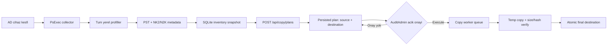

# O365 Legacy Artifact Discovery ve Copy Plan Mimarisi

## Amac

Bu katman PST envanterine ek olarak tum Windows kullanici profillerindeki Outlook `.nk2` ve `.n2k` legacy autocomplete dosyalarini raporlar. Kesfedilen PST/NK2/N2K dosyalari dogrudan kopyalanmaz; once degismez bir inventory snapshot'ina bagli copy plani olusturulur, ardindan yetkili kullanici hedefi ve oge sayisini gorerek plani acikca execute eder.

## Uctan Uca Akis



## Discovery Modeli

Collector aktif oturumla sinirli degildir. Cihazda mevcut tum Windows profil dizinleri SID bazinda ele alinir:

- Outlook profil ve hesap kayitlari yuklu/yuklu olmayan kullanici hive'larindan okunur.
- PST path, boyut, son degisim ve erisilebilirlik metadata olarak kaydedilir.
- Profil altindaki bilinen Outlook konumlari `.nk2` ve `.n2k` uzantilari icin taranir.
- Her legacy kayit cihaz, SID, kullanici adi, UPN, Outlook profil adi, artefact tipi, kaynak path, boyut ve son degisim zamaniyla raporlanir.
- Ayni SID/path birden fazla kaynaktan bulunursa merkezi raporda tekillestirilir.

`N2K`, standart Outlook `NK2` uzantisinin ters yazilmis varyanti olarak ayri artefact tipiyle korunur. Boylece sahadaki gercek dosya uzantisi raporda kaybolmaz.

## API ve RBAC

| Endpoint | Islem | Beklenen rol |
|---|---|---|
| `GET /api/inventory/legacy-files` | Legacy artefact raporu ve filtreler | `AuditReader` |
| `POST /api/copy/plans` | Inventory snapshot'indan plan olusturma | `MigrationPlanner` |
| `GET /api/copy/plans` | Plan/durum goruntuleme | `AuditReader` |
| `POST /api/copy/plans/{id}/execute` | Plan worker kuyruguna alma | `AuditAdmin` |

Plan olusturma body ornegi:

```json
{
  "targetRoot": "\\\\filesrv01\\O365Migration",
  "devices": [ "PC-FIN-001" ],
  "users": [ "user@contoso.local" ],
  "artifactTypes": [ "PST", "NK2", "N2K" ]
}
```

Bos `devices` veya `users` filtresi tum mevcut snapshot kapsamini ifade eder. `targetRoot` bos birakilirsa yalnizca sunucuda yapilandirilmis `Copy:DefaultTargetRoot` kullanilir. Hedef her durumda `Copy:AllowedTargetRoots` altinda kalmalidir.

## Hedef Dizin Taksonomisi

Dosyalar hesap ve cihaz ayrimini kaybetmeyecek deterministik bir agacta saklanir:

```text
<CopyTargetRoot>\
`-- <UserKey>\
    `-- <DeviceName>\
        `-- <ProfileName>\
            |-- PST\
            |   `-- archive_<source-hash>.pst
            |-- NK2\
            |   `-- Outlook.nk2
            `-- N2K\
                `-- legacy.n2k
```

- `UserKey` icin oncelik UPN/e-posta, domain kullanici adi, son olarak SID'dir.
- Path icin gecersiz karakterler guvenli bir bicimde normalize edilir.
- Ayni hedef ada dusen farkli kaynaklar deterministik bir suffix/hash ile ayrilir; sessiz overwrite yapilmaz.
- Ayni fiziksel artefact iki farkli kullanici/profil sahibine cozulurse plan otomatik sahip secmez; user-filtered plan ve operator dogrulamasi isteyerek fail-closed durur.
- Kaynak yerel path ise worker bunu cihaz admin share path'ine donusturur: `C:\Data\a.pst` → `\\PC-001\C$\Data\a.pst`.
- UNC kaynak path yalnizca `Copy:AllowedSourceUncRoots` allowlist'inde acikca izin verilen server/share altindaysa kullanilir; varsayilan fail-closed'dur.

## Iki Asamali Guvenlik Modeli

1. **Plan:** Kesif snapshot'indaki source path, source boyutu/mtime ve hesap-cihaz-profil baglami kalici plan ogelerine yazilir. Bu asama dosya I/O baslatmaz.
2. **Execute:** Dashboard plan kimligini, hedefi ve oge sayisini gosterir. Kullanici acik onay kutusunu secmeden execute butonu aktif olmaz.
3. **Server gate:** UI onayi tek basina guven siniri degildir. API `AuditAdmin`, `Copy:Enabled` ve allowed-root kontrolunu yeniden uygular.
4. **Worker:** Dosya once ayni hedef dizinde gecici `.partial-*` ada kopyalanir. Varsayilan SHA-256 ve boyut dogrulamasindan sonra final ada atomik olarak tasinir.
5. **Degisim korumasi:** Kaynak exclusive acilamiyorsa copy durur ve Outlook'un kapatilmasi veya VSS snapshot kullanilmasi istenir. Hedef dizin zincirinde reparse point/junction bulunursa islem fail-closed olur.
6. **Idempotency:** Mevcut hedef SHA-256 ile ayniysa oge `Skipped`; farkli icerik varsa overwrite edilmeden hata uretilir.

## Yetki Sinirlari

Onerilen servis kimligi sinirli bir gMSA'dir:

- Audit kapsamindaki endpointlerde local Administrator ve `ADMIN$` read.
- Collector share icin read.
- Migration hedef share'de `Change`, NTFS agacinda `Modify`.
- AD'de yalnizca bilgisayar nesnesi okuma.

Uygulama hedef ACL'sini otomatik olarak degistirmez. Deployment yalnizca girilen hedefin mevcut hesaptan erisilebilir oldugunu kontrol eder; gMSA effective access testi ayrica yapilmalidir. LocalSystem kullanimi uzak kaynak ve hedefte yonetim sunucusu bilgisayar hesabina genis yetki verilmesini gerektirdigi icin onerilmez.

## Operasyon ve Gozlemlenebilirlik

- Once tek cihaz/tek kullanici ve kucuk bir NK2 planiyla smoke test yapin.
- Sonra tek PST ile boyut ve SHA-256 davranisini dogrulayin.
- Plan durumlari: `Planned`, `Queued`, `Running`, `Completed`, `CompletedWithErrors`, `Failed`.
- Oge durumlari: `Planned`, `Queued`, `Copying`, `Completed`, `Skipped`, `Failed`.
- Hata kaydinda kaynak, hedef, deneme sayisi ve hata mesaji korunmalidir.
- Buyuk PST batch'lerinde hedef kapasitesi, SMB throughput, antivirus etkisi ve `Copy:MaxParallelism` birlikte izlenmelidir.

Deployment ve servis hesabi smoke testleri icin [DEPLOYMENT-DC.md](DEPLOYMENT-DC.md) runbook'unu izleyin.
